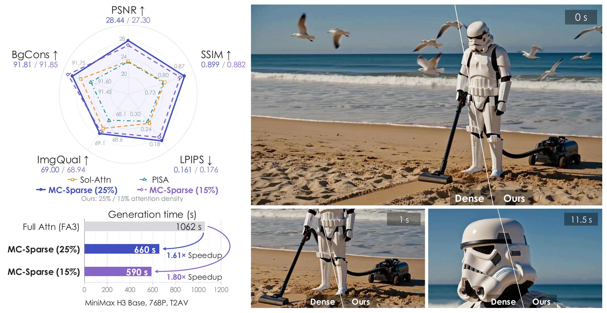
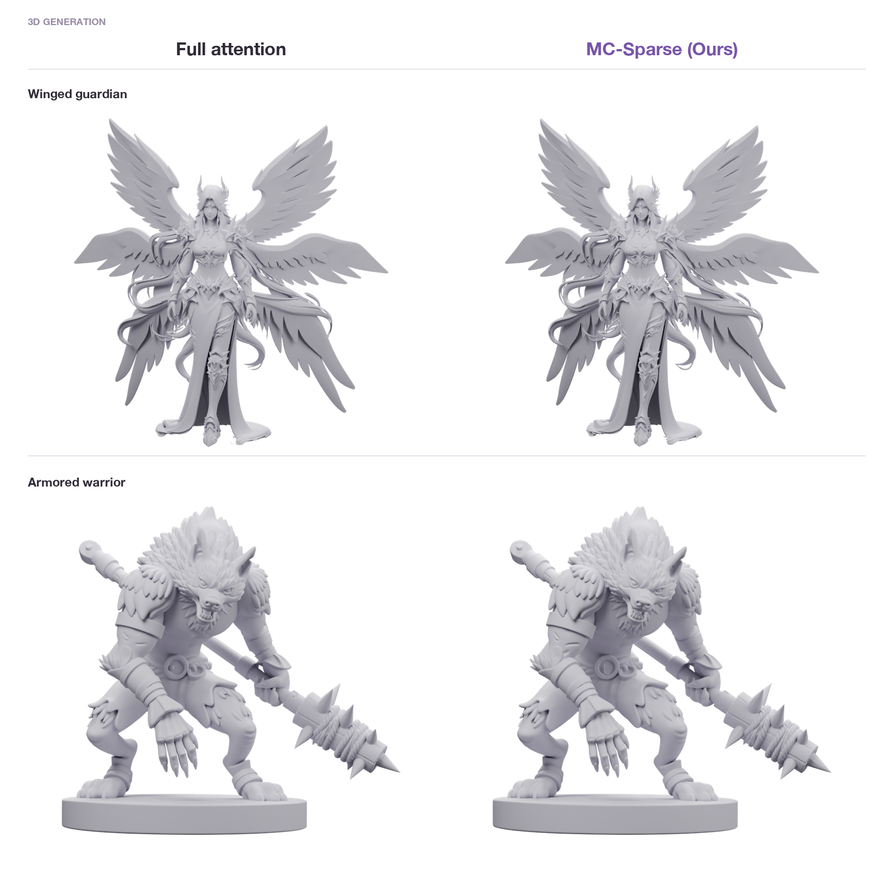
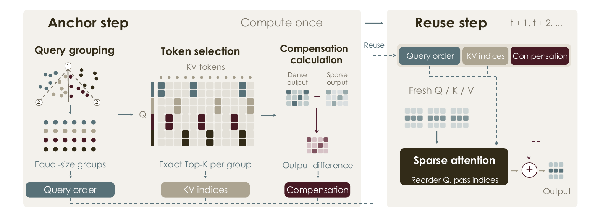

# MC-Sparse

Code for **MC-Sparse: Deconstructing and Closing the Dense–Sparse Attention Gap in Diffusion Transformers**.

**[Project page](https://dodododddo.github.io/mcsparse-project-page/)** · [Paper](https://arxiv.org/abs/2610.06801)

[](https://dodododddo.github.io/mcsparse-project-page/)

Visit the project page for full videos, interactive mesh comparisons, the method overview, and experimental results.

[](https://dodododddo.github.io/mcsparse-project-page/#geometry)

[Explore the interactive comparisons →](https://dodododddo.github.io/mcsparse-project-page/#geometry)

This repository contains the token-sparse attention kernels and their MiniMax-H3 integration. At anchor steps, MC-Sparse groups similar queries, selects individual KV tokens using exact attention mass, and caches the dense–sparse output residual. Subsequent steps reuse that metadata while computing attention with fresh Q, K, and V.



## Setup

**Currently, only NVIDIA Hopper GPUs are supported.** Use a CUDA-enabled PyTorch environment and install the package and H3 dependencies from the repository root:

```bash
python -m pip install -e ".[h3]"
```

For kernel-only work, use `python -m pip install -e .`. Package dependencies are listed in [pyproject.toml](pyproject.toml).

The token-sparse H3 path also requires a compatible [FlashAttention-3 installation](https://github.com/Dao-AILab/flash-attention/tree/main/hopper) exposing `flash_attn_interface`. It is used to compute dense attention outputs and log-sum-exp values during calibration. Follow the upstream installation requirements separately.

## Usage

Check the environment, list the bundled prompts, and generate a sample:

```bash
mcsparse info
mcsparse examples
mcsparse run --prompt-file examples/prompts.jsonl --index 0 \
  --out out.mp4 --json-out result.json
```

The pipeline uses `MiniMaxAI/MiniMax-H3` by default. Pass `--model /path/to/MiniMax-H3` or set `H3_MODEL` to use a local checkpoint. Use `mcsparse run --help` for attention, memory, and device-layout options.

## Common scripts

Choose a script for your GPU layout. For example:

```bash
INDEX=0 OUT_DIR=runs/example bash scripts/run_1gpu_5s.sh
```

| Script | Purpose |
| --- | --- |
| [run_1gpu_5s.sh](scripts/run_1gpu_5s.sh) | Short single-GPU generation. |
| [run_1gpu_15s.sh](scripts/run_1gpu_15s.sh) | Longer single-GPU generation. |
| [run_7p1gpu_15s.sh](scripts/run_7p1gpu_15s.sh) | Serving-oriented layout: a dedicated GPU keeps the text encoder resident after encoding; the other GPUs denoise with Ulysses context parallelism. |
| [run_8gpu_shared.sh](scripts/run_8gpu_shared.sh) | Offload after encoding: the text encoder returns to CPU memory, freeing GPU memory for denoising with Ulysses context parallelism. No dedicated encoder GPU. |

The key choice is whether to keep the text encoder resident on its own GPU or offload it after encoding. The `shared` filename refers to the latter.

The scripts use [examples/prompts.jsonl](examples/prompts.jsonl). Set `IR` to another JSONL file with H3 Context-IR prompts in an `ir` field. Common overrides include `INDEX`, `OUT_DIR`, `GPU` or `NPROC`, `TOPK` or `TOPKS`, and `CALIBRATE`; see each script and [scripts/_common.sh](scripts/_common.sh) for the supported options. Use a separate output directory for each configuration.

Runs write generated media and JSON diagnostics. Check `kernel_calls` and fallback counters to confirm that the sparse path executed.

## Tests and benchmarks

The pure-logic suite runs without PyTorch or CUDA and checks schedules, counters, sink handling, and dispatch eligibility:

```bash
python tests/test_token_sparse_logic.py
```

The following benchmarks require a compatible CUDA environment:

```bash
python tests/bench_token_sparse.py  # Gather-KV attention kernel
python tests/bench_pca_group.py     # Fast PDDP query grouping
```

Use `--help` on either benchmark to inspect its shape and memory settings.

## TODO

- [ ] Further optimize Fast PDDP query-grouping speed.
- [ ] Expose and validate whitening support in the H3 integration and CLI.

## Acknowledgments

Our CuTeDSL sparse-attention implementation builds on code from **[FlashAttention-4 (FA4)](https://github.com/Dao-AILab/flash-attention)**. We thank the FlashAttention authors for releasing their implementation. We also acknowledge [NVIDIA CUTLASS / CuTeDSL](https://github.com/NVIDIA/cutlass) and the upstream contributors whose code and utilities this implementation uses.

## License

[Apache License 2.0](LICENSE). Upstream code retains its original notices; see [NOTICE](NOTICE) and the source headers.
